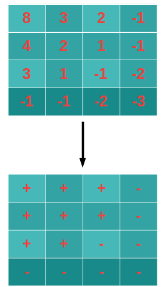

# [LeetCode][leetcode] task # 1351: [Count Negative Numbers in a Sorted Matrix][task]

Description
-----------

> Given a `m x n` matrix `grid` which is sorted in non-increasing order both row-wise and column-wise,
> return _the number of **negative** numbers in grid_.

 Example
-------




```sh
Input: grid = [[8,3,2,-1],[4,2,1,-1],[3,1,-1,-2],[-1,-1,-2,-3]]
Output: 8
Explanation: There are 8 negatives number in the matrix.
```

Solution
--------

| Task | Solution                                              |
|:----:|:------------------------------------------------------|
| 1351 | [Count Negative Numbers in a Sorted Matrix][solution] |


[leetcode]: <http://leetcode.com/>
[task]: <https://leetcode.com/problems/count-negative-numbers-in-a-sorted-matrix/>
[solution]: <https://github.com/wellaxis/praxis-leetcode/blob/main/src/main/java/com/witalis/praxis/leetcode/task/h14/p1351/option/Practice.java>
