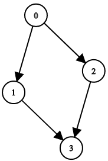

# [LeetCode][leetcode] task # 1361: [Validate Binary Tree Nodes][task]

Description
-----------

> You have `n` binary tree nodes numbered from `0` to `n - 1` where node `i` has two children `leftChild[i]` and `rightChild[i]`,
> return _`true` if and only if **all** the given nodes form **exactly one** valid binary tree_.
> 
> If node `i` has no left child then `leftChild[i]` will equal `-1`, similarly for the right child.
> 
> **Note** that the nodes have no values and that we only use the node numbers in this problem.

Example
-------



```sh
Input: n = 4, leftChild = [1,-1,3,-1], rightChild = [2,3,-1,-1]
Output: false
```

Solution
--------

| Task | Solution                               |
|:----:|:---------------------------------------|
| 1361 | [Validate Binary Tree Nodes][solution] |


[leetcode]: <http://leetcode.com/>
[task]: <https://leetcode.com/problems/validate-binary-tree-nodes/>
[solution]: <https://github.com/wellaxis/praxis-leetcode/blob/main/src/main/java/com/witalis/praxis/leetcode/task/h14/p1361/option/Practice.java>
