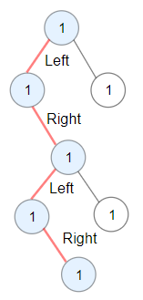

# [LeetCode][leetcode] task # 1372: [Longest ZigZag Path in a Binary Tree][task]

Description
-----------

> You are given the `root` of a binary tree.
> 
> A **ZigZag** path for a binary tree is defined as follows:
> * Choose any node in the binary tree and a direction (right or left).
> * If the current direction is right, move to the right child of the current node; otherwise, move to the left child.
> * Change the direction from right to left or from left to right.
> * Repeat the second and third steps until you can't move in the tree.
>
> Zigzag length is defined as the number of nodes visited - 1. (A single node has a length of 0).
> 
> Return _the longest **ZigZag** path contained in that tree_.

 Example
-------



```sh
Input: root = [1,1,1,null,1,null,null,1,1,null,1]
Output: 4
Explanation: Longest ZigZag path in blue nodes (left -> right -> left -> right).
```

Solution
--------

| Task | Solution                                         |
|:----:|:-------------------------------------------------|
| 1372 | [Longest ZigZag Path in a Binary Tree][solution] |


[leetcode]: <http://leetcode.com/>
[task]: <https://leetcode.com/problems/longest-zigzag-path-in-a-binary-tree/>
[solution]: <https://github.com/wellaxis/praxis-leetcode/blob/main/src/main/java/com/witalis/praxis/leetcode/task/h14/p1372/option/Practice.java>
