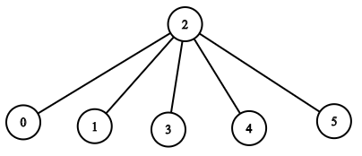

# [LeetCode][leetcode] task # 1376: [Time Needed to Inform All Employees][task]

Description
-----------

> A company has `n` employees with a unique ID for each employee from `0` to `n - 1`.
> The head of the company is the one with `headID`.
> 
> Each employee has one direct manager given in the `manager` array where `manager[i]`
> is the direct manager of the `i-th` employee, `manager[headID] = -1`.
> Also, it is guaranteed that the subordination relationships have a tree structure.
> 
> The head of the company wants to inform all the company employees of an urgent piece of news.
> He will inform his direct subordinates, and they will inform their subordinates,
> and so on until all employees know about the urgent news.
> 
> The `i-th` employee needs `informTime[i]` minutes to inform all of his direct subordinates
> (i.e., After `informTime[i]` minutes, all his direct subordinates can start spreading the news).
> 
> Return _the number of minutes needed to inform all the employees about the urgent news_.

Example
-------



```sh
Input: n = 6, headID = 2, manager = [2,2,-1,2,2,2], informTime = [0,0,1,0,0,0]
Output: 1
Explanation: The head of the company with id = 2 is the direct manager of all the employees
    in the company and needs 1 minute to inform them all.
    The tree structure of the employees in the company is shown.
```

Solution
--------

| Task | Solution                                        |
|:----:|:------------------------------------------------|
| 1376 | [Time Needed to Inform All Employees][solution] |


[leetcode]: <http://leetcode.com/>
[task]: <https://leetcode.com/problems/time-needed-to-inform-all-employees/>
[solution]: <https://github.com/wellaxis/praxis-leetcode/blob/main/src/main/java/com/witalis/praxis/leetcode/task/h14/p1376/option/Practice.java>
