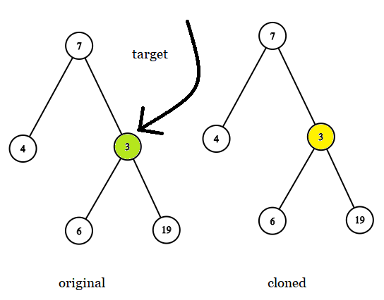

# [LeetCode][leetcode] task # 1379: [Find a Corresponding Node of a Binary Tree in a Clone of That Tree][task]

Description
-----------

> Given two binary trees original and cloned
> and given a reference to a node target in the original tree.
>
> The cloned tree is a copy of the original tree.
>
> Return a reference to the same node in the cloned tree.
>
> Note that you are not allowed to change any of the two trees
> or the target node and the answer must be a reference to a node in the cloned tree.

 Example
-------



```sh
Input: tree = [7,4,3,null,null,6,19], target = 3
Output: 3
Explanation: In all examples the original and cloned trees are shown.
             The target node is a green node from the original tree.
             The answer is the yellow node from the cloned tree.
```

Solution
--------

| Task | Solution                                                                       |
|:----:|:-------------------------------------------------------------------------------|
| 1379 | [Find a Corresponding Node of a Binary Tree in a Clone of That Tree][solution] |


[leetcode]: <http://leetcode.com/>
[task]: <https://leetcode.com/problems/find-a-corresponding-node-of-a-binary-tree-in-a-clone-of-that-tree/>
[solution]: <https://github.com/wellaxis/witalis-jkit/blob/main/module/tasks/src/main/java/com/witalis/jkit/tasks/core/task/leetcode/h14/p1379/option/Practice.java>
