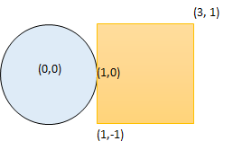

# [LeetCode][leetcode] task # 1401: [Circle and Rectangle Overlapping][task]

Description
-----------

> You are given a circle represented as `(radius, xCenter, yCenter)`
> and an axis-aligned rectangle represented as `(x1, y1, x2, y2)`,
> where `(x1, y1)` are the coordinates of the bottom-left corner,
> and `(x2, y2)` are the coordinates of the top-right corner of the rectangle.
> 
> Return _`true` if the circle and rectangle are overlapped otherwise return `false`_.
> In other words, check if there is any point `(xi, yi)` that belongs to the circle and the rectangle at the same time.

Example
-------



```sh
Input: radius = 1, xCenter = 0, yCenter = 0, x1 = 1, y1 = -1, x2 = 3, y2 = 1
Output: true
Explanation: Circle and rectangle share the point (1,0).
```

Solution
--------

| Task | Solution                                     |
|:----:|:---------------------------------------------|
| 1401 | [Circle and Rectangle Overlapping][solution] |


[leetcode]: <http://leetcode.com/>
[task]: <https://leetcode.com/problems/circle-and-rectangle-overlapping/>
[solution]: <https://github.com/wellaxis/praxis-leetcode/blob/main/src/main/java/com/witalis/praxis/leetcode/task/h15/p1401/option/Practice.java>
