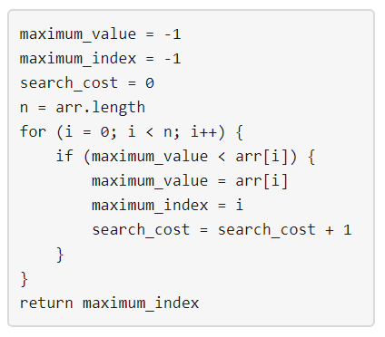

# [LeetCode][leetcode] task # 1420: [Build Array Where You Can Find The Maximum Exactly K Comparisons][task]

Description
-----------

> You are given three integers `n`, `m` and `k`.
> Consider the following algorithm to find the maximum element of an array of positive integers:
> 
> 
> 
> You should build the array arr which has the following properties:
> * `arr` has exactly `n` integers.
> * `1 <= arr[i] <= m` where `(0 <= i < n)`.
> * After applying the mentioned algorithm to `arr`, the value `search_cost` is equal to `k`.
> 
> Return _the number of ways to build the array `arr` under the mentioned conditions_.
> As the answer may grow large, the answer **must be** computed modulo `10^9 + 7`.

Example
-------

```sh
Input: n = 2, m = 3, k = 1
Output: 6
Explanation: The possible arrays are [1, 1], [2, 1], [2, 2], [3, 1], [3, 2] [3, 3]
```

Solution
--------

| Task | Solution                                                                     |
|:----:|:-----------------------------------------------------------------------------|
| 1420 | [Build Array Where You Can Find The Maximum Exactly K Comparisons][solution] |


[leetcode]: <http://leetcode.com/>
[task]: <https://leetcode.com/problems/build-array-where-you-can-find-the-maximum-exactly-k-comparisons/>
[solution]: <https://github.com/wellaxis/praxis-leetcode/blob/main/src/main/java/com/witalis/praxis/leetcode/task/h15/p1420/option/Practice.java>
