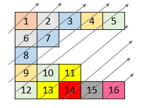

# [LeetCode][leetcode] task # 1424: [Diagonal Traverse II][task]

Description
-----------

> Given a 2D integer array `nums`, return _all elements of `nums` in diagonal order as shown in the below images_.

Example
-------



```sh
Input: nums = [[1,2,3,4,5],[6,7],[8],[9,10,11],[12,13,14,15,16]]
Output: [1,6,2,8,7,3,9,4,12,10,5,13,11,14,15,16]
```

Solution
--------

| Task | Solution                         |
|:----:|:---------------------------------|
| 1424 | [Diagonal Traverse II][solution] |


[leetcode]: <http://leetcode.com/>
[task]: <https://leetcode.com/problems/diagonal-traverse-ii/>
[solution]: <https://github.com/wellaxis/praxis-leetcode/blob/main/src/main/java/com/witalis/praxis/leetcode/task/h15/p1424/option/Practice.java>
