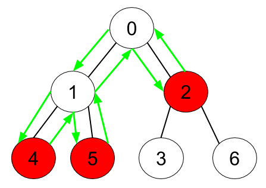

# [LeetCode][leetcode] task # 1443: [Minimum Time to Collect All Apples in a Tree][task]

Description
-----------

> Given an undirected tree consisting of `n` vertices numbered from `0` to `n-1`,
> which has some apples in their vertices. You spend 1 second to walk over one edge of the tree.
> Return _the minimum time in seconds you have to spend to collect all apples in the tree,
> starting at **vertex 0** and coming back to this vertex_.
> 
> The edges of the undirected tree are given in the array `edges`,
> where `edges[i] = [ai, bi]` means that exists an edge connecting the vertices `ai` and `bi`.
> Additionally, there is a boolean array `hasApple`, where `hasApple[i] = true` means
> that vertex `i` has an apple; otherwise, it does not have any apple.

Example
-------



```sh
Input: n = 7, edges = [[0,1],[0,2],[1,4],[1,5],[2,3],[2,6]], hasApple = [false,false,true,false,true,true,false]
Output: 8 
Explanation: The figure above represents the given tree where red vertices have an apple.
    One optimal path to collect all apples is shown by the green arrows.
```

Solution
--------

| Task | Solution                                                 |
|:----:|:---------------------------------------------------------|
| 1443 | [Minimum Time to Collect All Apples in a Tree][solution] |


[leetcode]: <http://leetcode.com/>
[task]: <https://leetcode.com/problems/minimum-time-to-collect-all-apples-in-a-tree/>
[solution]: <https://github.com/wellaxis/praxis-leetcode/blob/main/src/main/java/com/witalis/praxis/leetcode/task/h15/p1443/option/Practice.java>
