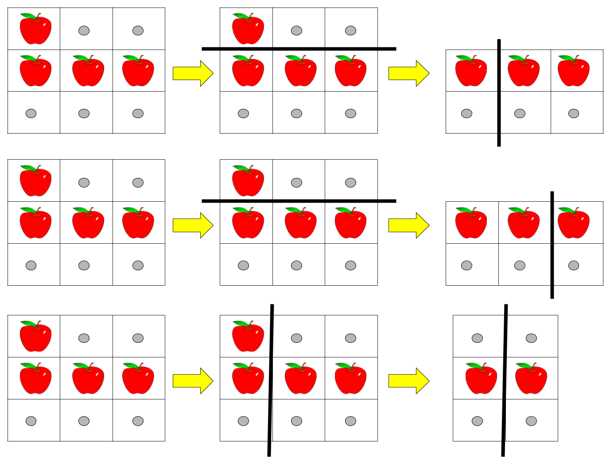

# [LeetCode][leetcode] task # 1444: [Number of Ways of Cutting a Pizza][task]

Description
-----------

> Given a rectangular pizza represented as a `rows x cols` matrix containing the following characters:
> `'A'` (an apple) and `'.'` (empty cell) and given the integer `k`.
> You have to cut the pizza into `k` pieces using `k-1` cuts.
> 
> For each cut you choose the direction: vertical or horizontal,
> then you choose a cut position at the cell boundary and cut the pizza into two pieces.
> If you cut the pizza vertically, give the left part of the pizza to a person.
> If you cut the pizza horizontally, give the upper part of the pizza to a person.
> Give the last piece of pizza to the last person.
> 
> Return _the number of ways of cutting the pizza such that each piece contains **at least** one apple_.
> Since the answer can be a huge number, return this modulo `10^9 + 7`.

Example
-------



```sh
Input: pizza = ["A..","AAA","..."], k = 3
Output: 3 
Explanation: The figure above shows the three ways to cut the pizza. Note that pieces must contain at least one apple.
```

Solution
--------

| Task | Solution                                      |
|:----:|:----------------------------------------------|
| 1444 | [Number of Ways of Cutting a Pizza][solution] |


[leetcode]: <http://leetcode.com/>
[task]: <https://leetcode.com/problems/number-of-ways-of-cutting-a-pizza/>
[solution]: <https://github.com/wellaxis/praxis-leetcode/blob/main/src/main/java/com/witalis/praxis/leetcode/task/h15/p1444/option/Practice.java>
