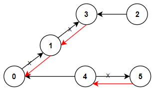

# [LeetCode][leetcode] task # 1466: [Reorder Routes to Make All Paths Lead to the City Zero][task]

Description
-----------

> There are `n` cities numbered from `0` to `n - 1` and `n - 1` roads such that
> there is only one way to travel between two different cities (this network form a tree).
> Last year, The ministry of transport decided to orient the roads in one direction because they are too narrow.
> 
> Roads are represented by `connections` where `connections[i] = [ai, bi]` represents a road from city `ai` to city `bi`.
> 
> This year, there will be a big event in the capital (city `0`), and many people want to travel to this city.
> 
> Your task consists of reorienting some roads such that each city can visit the city `0`.
> Return _the **minimum** number of edges changed_.
> 
> It's **guaranteed** that each city can reach city `0` after reorder.

 Example
-------



```sh
Input: n = 6, connections = [[0,1],[1,3],[2,3],[4,0],[4,5]]
Output: 3
Explanation: Change the direction of edges show in red such that each node can reach the node 0 (capital).
```

Solution
--------

| Task | Solution                                                           |
|:----:|:-------------------------------------------------------------------|
| 1466 | [Reorder Routes to Make All Paths Lead to the City Zero][solution] |


[leetcode]: <http://leetcode.com/>
[task]: <https://leetcode.com/problems/reorder-routes-to-make-all-paths-lead-to-the-city-zero/>
[solution]: <https://github.com/wellaxis/praxis-leetcode/blob/main/src/main/java/com/witalis/praxis/leetcode/task/h15/p1466/option/Practice.java>
