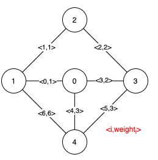
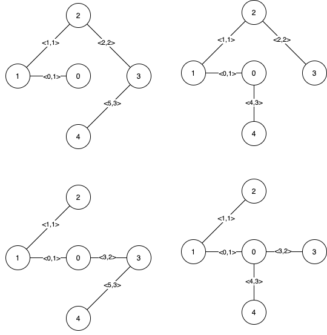

# [LeetCode][leetcode] task # 1489: [Find Critical and Pseudo-Critical Edges in Minimum Spanning Tree][task]

Description
-----------

> Given a weighted undirected connected graph with `n` vertices numbered from `0` to `n - 1`,
> and an array `edges` where `edges[i] = [ai, bi, weighti]` represents a bidirectional and weighted edge between nodes `ai` and `bi`.
> A **minimum spanning tree** (MST) is a subset of the graph's edges that connects all vertices
> without cycles and with the minimum possible total edge weight.
> 
> Find _all the critical and pseudo-critical edges in the given graph's minimum spanning tree (MST)_.
> An MST edge whose deletion from the graph would cause the MST weight to increase is called a critical edge.
> On the other hand, a pseudo-critical edge is that which can appear in some MSTs but not all.
> 
> **Note** that you can return the indices of the edges in any order.

 Example
-------



```sh
Input: n = 5, edges = [[0,1,1],[1,2,1],[2,3,2],[0,3,2],[0,4,3],[3,4,3],[1,4,6]]
Output: [[0,1],[2,3,4,5]]
Explanation: The figure above describes the graph.
```
The following figure shows all the possible MSTs:



Notice that the two edges 0 and 1 appear in all MSTs, therefore they are critical edges, so we return them in the first list of the output.
The edges 2, 3, 4, and 5 are only part of some MSTs, therefore they are considered pseudo-critical edges. We add them to the second list of the output.

Solution
--------

| Task | Solution                                                                     |
|:----:|:-----------------------------------------------------------------------------|
| 1489 | [Find Critical and Pseudo-Critical Edges in Minimum Spanning Tree][solution] |


[leetcode]: <http://leetcode.com/>
[task]: <https://leetcode.com/problems/find-critical-and-pseudo-critical-edges-in-minimum-spanning-tree/>
[solution]: <https://github.com/wellaxis/praxis-leetcode/blob/main/src/main/java/com/witalis/praxis/leetcode/task/h15/p1489/option/Practice.java>
