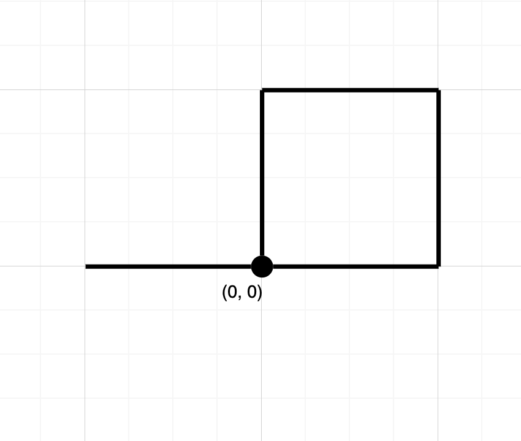

# [LeetCode][leetcode] task # 1496: [Path Crossing][task]

Description
-----------

> Given a string `path`, where `path[i] = 'N', 'S', 'E' or 'W'`, each representing
> moving one unit north, south, east, or west, respectively.
> You start at the origin `(0, 0)` on a 2D plane and walk on the path specified by `path`.
> 
> Return _true if the path crosses itself at any point, that is,
> if at any time you are on a location you have previously visited_.
> Return _false otherwise_.

Example
-------



```sh
Input: path = "NESWW"
Output: true
Explanation: Notice that the path visits the origin twice.
```

Solution
--------

| Task | Solution                  |
|:----:|:--------------------------|
| 1496 | [Path Crossing][solution] |


[leetcode]: <http://leetcode.com/>
[task]: <https://leetcode.com/problems/path-crossing/>
[solution]: <https://github.com/wellaxis/praxis-leetcode/blob/main/src/main/java/com/witalis/praxis/leetcode/task/h15/p1496/option/Practice.java>
