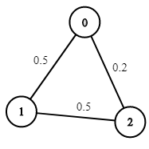

# [LeetCode][leetcode] task # 1514: [Path with Maximum Probability][task]

Description
-----------

> You are given an undirected weighted graph of `n` nodes (**0-indexed**),
> represented by an edge list where `edges[i] = [a, b]` is an undirected edge connecting
> the nodes `a` and `b` with a probability of success of traversing that edge `succProb[i]`.
> 
> Given two nodes `start` and `end`, find the path with the maximum probability of success
> to go from `start` to `end` and return _its success probability_.
> 
> If there is no path from `start` to `end`, **return 0**.
> Your answer will be accepted if it differs from the correct answer by at most **1e-5**.

Example
-------



```sh
Input: n = 3, edges = [[0,1],[1,2],[0,2]], succProb = [0.5,0.5,0.2], start = 0, end = 2
Output: 0.25000
Explanation: There are two paths from start to end, one having a probability of success = 0.2 and the other has 0.5 * 0.5 = 0.25.
```

Solution
--------

| Task | Solution                                  |
|:----:|:------------------------------------------|
| 1514 | [Path with Maximum Probability][solution] |


[leetcode]: <http://leetcode.com/>
[task]: <https://leetcode.com/problems/path-with-maximum-probability/>
[solution]: <https://github.com/wellaxis/praxis-leetcode/blob/main/src/main/java/com/witalis/praxis/leetcode/task/h16/p1514/option/Practice.java>
