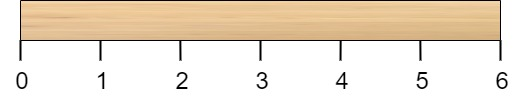
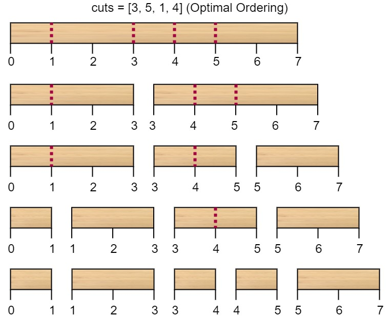

# [LeetCode][leetcode] task # 1547: [Minimum Cost to Cut a Stick][task]

Description
-----------

> Given a wooden stick of length `n` units. The stick is labelled from `0` to `n`.
> For example, a stick of length **6** is labelled as follows:
> 
> 
> 
> Given an integer array `cuts` where `cuts[i]` denotes a position you should perform a cut at.
> 
> You should perform the cuts in order, you can change the order of the cuts as you wish.
> 
> The cost of one cut is the length of the stick to be cut, the total cost is the sum of costs of all cuts.
> When you cut a stick, it will be split into two smaller sticks
> (i.e. the sum of their lengths is the length of the stick before the cut).
> Please refer to the first example for a better explanation.
> 
> Return _the minimum total cost of the cuts_.

Example
-------



```sh
Input: n = 7, cuts = [1,3,4,5]
Output: 16
```

Solution
--------

| Task | Solution                                |
|:----:|:----------------------------------------|
| 1547 | [Minimum Cost to Cut a Stick][solution] |


[leetcode]: <http://leetcode.com/>
[task]: <https://leetcode.com/problems/minimum-cost-to-cut-a-stick/>
[solution]: <https://github.com/wellaxis/praxis-leetcode/blob/main/src/main/java/com/witalis/praxis/leetcode/task/h16/p1547/option/Practice.java>
