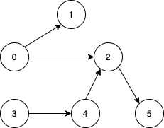

# [LeetCode][leetcode] task # 1557: [Minimum Number of Vertices to Reach All Nodes][task]

Description
-----------

> Given a **directed acyclic graph**, with `n` vertices numbered from `0` to `n-1`,
> and an array `edges` where `edges[i] = [from[i], to[i]]` represents a directed edge from node `from[i]` to node `to[i]`.
> 
> Find _the smallest set of vertices from which all nodes in the graph are reachable_.
> It's guaranteed that a unique solution exists.
> 
> Notice that you can return the vertices in any order.

Example
-------



```sh
Input: n = 6, edges = [[0,1],[0,2],[2,5],[3,4],[4,2]]
Output: [0,3]
Explanation: It's not possible to reach all the nodes from a single vertex.
    From 0 we can reach [0,1,2,5]. From 3 we can reach [3,4,2,5]. So we output [0,3].
```

Solution
--------

| Task | Solution                                                  |
|:----:|:----------------------------------------------------------|
| 1557 | [Minimum Number of Vertices to Reach All Nodes][solution] |


[leetcode]: <http://leetcode.com/>
[task]: <https://leetcode.com/problems/minimum-number-of-vertices-to-reach-all-nodes/>
[solution]: <https://github.com/wellaxis/praxis-leetcode/blob/main/src/main/java/com/witalis/praxis/leetcode/task/h16/p1557/option/Practice.java>
