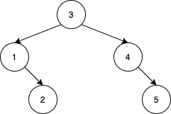

# [LeetCode][leetcode] task # 1569: [Number of Ways to Reorder Array to Get Same BST][task]

Description
-----------

> Given an array `nums` that represents a permutation of integers from `1` to `n`.
> We are going to construct a binary search tree (BST)
> by inserting the elements of `nums` in order into an initially empty BST.
> Find the number of different ways to reorder `nums`
> so that the constructed BST is identical to that formed from the original array `nums`.
> 
> * For example, given `nums = [2,1,3]`, we will have 2 as the root, 1 as a left child, and 3 as a right child.
> The array `[2,3,1]` also yields the same BST but `[3,2,1]` yields a different BST.
>
> Return _the number of ways to reorder `nums` such that
> the BST formed is identical to the original BST formed from `nums`_.
> 
> Since the answer may be very large, **return it modulo** `10^9 + 7`.

Example
-------



```sh
Input: nums = [3,4,5,1,2]
Output: 5
Explanation: The following 5 arrays will yield the same BST: 
    [3,1,2,4,5]
    [3,1,4,2,5]
    [3,1,4,5,2]
    [3,4,1,2,5]
    [3,4,1,5,2]
```

Solution
--------

| Task | Solution                                                    |
|:----:|:------------------------------------------------------------|
| 1569 | [Number of Ways to Reorder Array to Get Same BST][solution] |


[leetcode]: <http://leetcode.com/>
[task]: <https://leetcode.com/problems/number-of-ways-to-reorder-array-to-get-same-bst/>
[solution]: <https://github.com/wellaxis/praxis-leetcode/blob/main/src/main/java/com/witalis/praxis/leetcode/task/h16/p1569/option/Practice.java>
