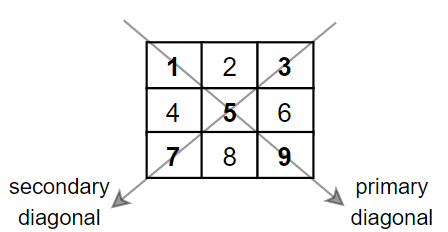

# [LeetCode][leetcode] task # 1572: [Matrix Diagonal Sum][task]

Description
-----------

> Given a square matrix `mat`, return _the sum of the matrix diagonals_.
> 
> Only include the sum of all the elements on the primary diagonal
> and all the elements on the secondary diagonal that are not part of the primary diagonal.

 Example
-------




```sh
Input: mat = [
    [1,2,3],
    [4,5,6],
    [7,8,9]
]
Output: 25
Explanation: Diagonals sum: 1 + 5 + 9 + 3 + 7 = 25
    Notice that element mat[1][1] = 5 is counted only once.
```

Solution
--------

| Task | Solution                        |
|:----:|:--------------------------------|
| 1572 | [Matrix Diagonal Sum][solution] |


[leetcode]: <http://leetcode.com/>
[task]: <https://leetcode.com/problems/matrix-diagonal-sum/>
[solution]: <https://github.com/wellaxis/praxis-leetcode/blob/main/src/main/java/com/witalis/praxis/leetcode/task/h16/p1572/option/Practice.java>
