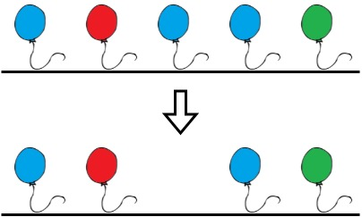

# [LeetCode][leetcode] task # 1578: [Minimum Time to Make Rope Colorful][task]

Description
-----------

> Alice has `n` balloons arranged on a rope.
> You are given a **0-indexed** string `colors` where `colors[i]` is the color of the `i^th` balloon.
> 
> Alice wants the rope to be **colorful**. She does not want **two consecutive balloons** to be of the same color,
> so she asks Bob for help. Bob can remove some balloons from the rope to make it **colorful**.
> You are given a **0-indexed** integer array `neededTime` where `neededTime[i]` is the time (in seconds)
> that Bob needs to remove the `i^th` balloon from the rope.
> 
> Return _the **minimum time** Bob needs to make the rope **colorful**_.

Example
-------



```sh
Input: colors = "abaac", neededTime = [1,2,3,4,5]
Output: 3
Explanation: In the above image, 'a' is blue, 'b' is red, and 'c' is green.
    Bob can remove the blue balloon at index 2. This takes 3 seconds.
    There are no longer two consecutive balloons of the same color. Total time = 3.
```

Solution
--------

| Task | Solution                                       |
|:----:|:-----------------------------------------------|
| 1578 | [Minimum Time to Make Rope Colorful][solution] |


[leetcode]: <http://leetcode.com/>
[task]: <https://leetcode.com/problems/minimum-time-to-make-rope-colorful/>
[solution]: <https://github.com/wellaxis/praxis-leetcode/blob/main/src/main/java/com/witalis/praxis/leetcode/task/h16/p1578/option/Practice.java>
