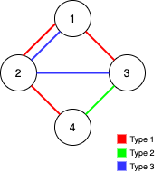

# [LeetCode][leetcode] task # 1579: [Remove Max Number of Edges to Keep Graph Fully Traversable][task]

Description
-----------

> Alice and Bob have an undirected graph of `n` nodes and three types of edges:
> * Type 1: Can be traversed by Alice only.
> * Type 2: Can be traversed by Bob only.
> * Type 3: Can be traversed by both Alice and Bob.
>
> Given an array `edges` where `edges[i] = [type[i], u[i], v[i]]` represents
> a bidirectional edge of type `type[i]` between nodes `u[i]` and `v[i]`,
> find the maximum number of edges you can remove so that after removing the edges,
> the graph can still be fully traversed by both Alice and Bob.
> The graph is fully traversed by Alice and Bob if starting from any node, they can reach all other nodes.
> 
> Return _the maximum number of edges you can remove, or return `-1` if Alice and Bob cannot fully traverse the graph_.

Example
-------




```sh
Input: n = 4, edges = [[3,1,2],[3,2,3],[1,1,3],[1,2,4],[1,1,2],[2,3,4]]
Output: 2
Explanation: If we remove the 2 edges [1,1,2] and [1,1,3]. The graph will still be fully traversable by Alice and Bob.
    Removing any additional edge will not make it so. So the maximum number of edges we can remove is 2.
```

Solution
--------

| Task | Solution                                                               |
|:----:|:-----------------------------------------------------------------------|
| 1579 | [Remove Max Number of Edges to Keep Graph Fully Traversable][solution] |


[leetcode]: <http://leetcode.com/>
[task]: <https://leetcode.com/problems/remove-max-number-of-edges-to-keep-graph-fully-traversable/>
[solution]: <https://github.com/wellaxis/praxis-leetcode/blob/main/src/main/java/com/witalis/praxis/leetcode/task/h16/p1579/option/Practice.java>
