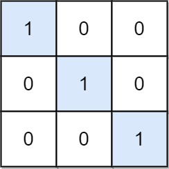

# [LeetCode][leetcode] task # 1582: [Special Positions in a Binary Matrix][task]

Description
-----------

> Given an `m x n` binary matrix `mat`, return _the number of **special** positions in `mat`_.
> 
> A position `(i, j)` is called **special** if `mat[i][j] == 1`
> and all other elements in row `i` and column `j` are `0` (rows and columns are **0-indexed**).

 Example
-------




```sh
Input: mat = [[1,0,0],[0,1,0],[0,0,1]]
Output: 3
Explanation: (0, 0), (1, 1) and (2, 2) are special positions.
```

Solution
--------

| Task | Solution                                         |
|:----:|:-------------------------------------------------|
| 1582 | [Special Positions in a Binary Matrix][solution] |


[leetcode]: <http://leetcode.com/>
[task]: <https://leetcode.com/problems/special-positions-in-a-binary-matrix/>
[solution]: <https://github.com/wellaxis/praxis-leetcode/blob/main/src/main/java/com/witalis/praxis/leetcode/task/h16/p1582/option/Practice.java>
