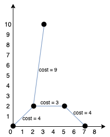

# [LeetCode][leetcode] task # 1584: [Min Cost to Connect All Points][task]

Description
-----------

> You are given an array `points` representing integer coordinates of some points on a 2D-plane, where `points[i] = [xi, yi]`.
> 
> The cost of connecting two points `[xi, yi]` and `[xj, yj]` is the **manhattan distance** between them:
> `|xi - xj| + |yi - yj|`, where `|val|` denotes the absolute value of `val`.
> 
> Return _the minimum cost to make all points connected_.
> All points are connected if there is **exactly one** simple path between any two points.

Example
-------





```sh
Input: points = [[0,0],[2,2],[3,10],[5,2],[7,0]]
Output: 20
Explanation:
    We can connect the points as shown above to get the minimum cost of 20.
    Notice that there is a unique path between every pair of points.
```

Solution
--------

| Task | Solution                                   |
|:----:|:-------------------------------------------|
| 1584 | [Min Cost to Connect All Points][solution] |


[leetcode]: <http://leetcode.com/>
[task]: <https://leetcode.com/problems/min-cost-to-connect-all-points/>
[solution]: <https://github.com/wellaxis/praxis-leetcode/blob/main/src/main/java/com/witalis/praxis/leetcode/task/h16/p1584/option/Practice.java>
