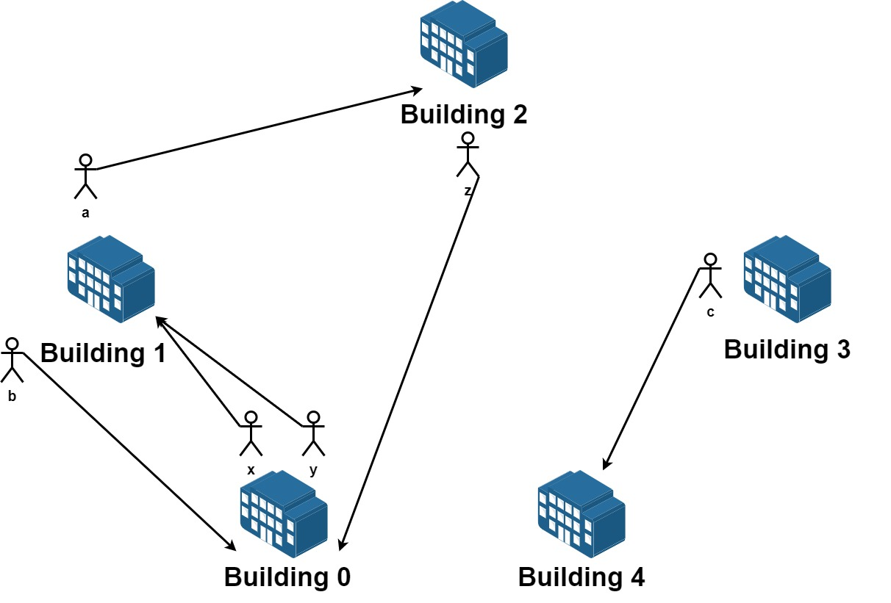

# [LeetCode][leetcode] task # 1601: [Maximum Number of Achievable Transfer Requests][task]

Description
-----------

> We have `n` buildings numbered from `0` to `n - 1`. Each building has a number of employees.
> It's transfer season, and some employees want to change the building they reside in.
> 
> You are given an array `requests` where `requests[i] = [fromi, toi]` represents
> an employee's request to transfer from building `fromi` to building `toi`.
> 
> **All buildings are full**, so a list of requests is achievable only if for each building,
> **the net change in employee transfers is zero**.
> This means the number of employees **leaving** is **equal** to the number of employees **moving in**.
> For example if `n = 3` and two employees are leaving building `0`, one is leaving building `1`,
> and one is leaving building `2`, there should be two employees moving to building `0`,
> one employee moving to building `1`, and one employee moving to building `2`.
> 
> Return _the maximum number of achievable requests_.

 Example
-------



```sh
Input: n = 5, requests = [[0,1],[1,0],[0,1],[1,2],[2,0],[3,4]]
Output: 5
Explantion: Let's see the requests:
    From building 0 we have employees x and y and both want to move to building 1.
    From building 1 we have employees a and b and they want to move to buildings 2 and 0 respectively.
    From building 2 we have employee z and they want to move to building 0.
    From building 3 we have employee c and they want to move to building 4.
    From building 4 we don't have any requests.
We can achieve the requests of users x and b by swapping their places.
We can achieve the requests of users y, a and z by swapping the places in the 3 buildings.
```

Solution
--------

| Task | Solution                                                   |
|:----:|:-----------------------------------------------------------|
| 1601 | [Maximum Number of Achievable Transfer Requests][solution] |


[leetcode]: <http://leetcode.com/>
[task]: <https://leetcode.com/problems/maximum-number-of-achievable-transfer-requests/>
[solution]: <https://github.com/wellaxis/praxis-leetcode/blob/main/src/main/java/com/witalis/praxis/leetcode/task/h17/p1601/option/Practice.java>
