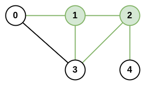

# [LeetCode][leetcode] task # 1615: [Maximal Network Rank][task]

Description
-----------

> There is an infrastructure of `n` cities with some number of `roads` connecting these cities.
> Each `roads[i] = [ai, bi]` indicates that there is a bidirectional road between cities `ai` and `bi`.
> 
> The **network rank** of **two different cities** is defined as
> the total number of **directly** connected roads to **either** city.
> If a road is directly connected to both cities, it is only counted **once**.
> 
> The **maximal network rank** of the infrastructure is the **maximum network rank** of all pairs of different cities.
> 
> Given the integer `n` and the array `roads`, return _the **maximal network rank** of the entire infrastructure_.

 Example
-------



```sh
Input: n = 5, roads = [[0,1],[0,3],[1,2],[1,3],[2,3],[2,4]]
Output: 5
Explanation: There are 5 roads that are connected to cities 1 or 2.
```

Solution
--------

| Task | Solution                         |
|:----:|:---------------------------------|
| 1615 | [Maximal Network Rank][solution] |


[leetcode]: <http://leetcode.com/>
[task]: <https://leetcode.com/problems/maximal-network-rank/>
[solution]: <https://github.com/wellaxis/praxis-leetcode/blob/main/src/main/java/com/witalis/praxis/leetcode/task/h17/p1615/option/Practice.java>
