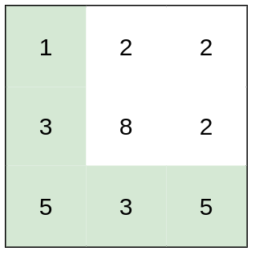

# [LeetCode][leetcode] task # 1631: [Path With Minimum Effort][task]

Description
-----------

> You are a hiker preparing for an upcoming hike. You are given `heights`, a 2D array of size `rows x columns`,
> where `heights[row][col]` represents the height of cell `(row, col)`.
> You are situated in the top-left cell, `(0, 0)`, and you hope to travel to the bottom-right cell,
> `(rows-1, columns-1)` (i.e., **0-indexed**).
> You can move **up**, **down**, **left**, or **right**, and you wish to find a route that requires the minimum **effort**.
> 
> A route's **effort** is the **maximum absolute difference** in heights between two consecutive cells of the route.
> 
> Return _the minimum **effort** required to travel from the top-left cell to the bottom-right cell_.

Example
-------




```sh
Input: heights = [[1,2,2],[3,8,2],[5,3,5]]
Output: 2
Explanation: The route of [1,3,5,3,5] has a maximum absolute difference of 2 in consecutive cells.
    This is better than the route of [1,2,2,2,5], where the maximum absolute difference is 3.
```

Solution
--------

| Task | Solution                             |
|:----:|:-------------------------------------|
| 1631 | [Path With Minimum Effort][solution] |


[leetcode]: <http://leetcode.com/>
[task]: <https://leetcode.com/problems/path-with-minimum-effort/>
[solution]: <https://github.com/wellaxis/praxis-leetcode/blob/main/src/main/java/com/witalis/praxis/leetcode/task/h17/p1631/option/Practice.java>
