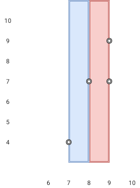

# [LeetCode][leetcode] task # 1637: [Widest Vertical Area Between Two Points Containing No Points][task]

Description
-----------

> Given `n` `points` on a 2D plane where `points[i] = [xi, yi]`.
> Return _the **widest vertical area** between two points such that no points are inside the area_.
> 
> A **vertical area** is an area of fixed-width extending infinitely along the y-axis (i.e., infinite height).
> The **widest vertical area** is the one with the maximum width.
> 
> Note that points **on the edge** of a vertical area are not considered included in the area.

Example
-------




```sh
Input: heights = [[1,2,2],[3,8,2],[5,3,5]]
Output: 2
Explanation: The route of [1,3,5,3,5] has a maximum absolute difference of 2 in consecutive cells.
    This is better than the route of [1,2,2,2,5], where the maximum absolute difference is 3.
```

Solution
--------

| Task | Solution                                                                 |
|:----:|:-------------------------------------------------------------------------|
| 1637 | [Widest Vertical Area Between Two Points Containing No Points][solution] |


[leetcode]: <http://leetcode.com/>
[task]: <https://leetcode.com/problems/widest-vertical-area-between-two-points-containing-no-points/>
[solution]: <https://github.com/wellaxis/praxis-leetcode/blob/main/src/main/java/com/witalis/praxis/leetcode/task/h17/p1637/option/Practice.java>
