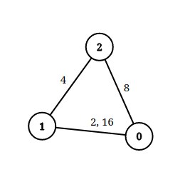

# [LeetCode][leetcode] task # 1697: [Checking Existence of Edge Length Limited Paths][task]

Description
-----------

> An undirected graph of `n` nodes is defined by `edgeList`, where `edgeList[i] = [u[i], v[i], dis[i]]` 
> denotes an edge between nodes `u[i]` and `v[i]` with distance `dis[i]`.
> Note that there may be **multiple** edges between two nodes.
> 
> Given an array `queries`, where `queries[j] = [p[j], q[j], limit[j]]`,
> your task is to determine for each `queries[j]` whether there is a path between `p[j]` and `q[j]`
> such that each edge on the path has a distance **strictly less than** `limit[j]`.
> 
> Return _a **boolean array** `answer`, where `answer.length == queries.length`
> and the `j^th` value of `answer` is `true` if there is a path for `queries[j]` is `true`, and `false` otherwise_.

Example
-------




```sh
Input: n = 3, edgeList = [[0,1,2],[1,2,4],[2,0,8],[1,0,16]], queries = [[0,1,2],[0,2,5]]
Output: [false,true]
Explanation: The above figure shows the given graph. Note that there are two overlapping edges between 0 and 1 with distances 2 and 16.
    For the first query, between 0 and 1 there is no path where each distance is less than 2, thus we return false for this query.
    For the second query, there is a path (0 -> 1 -> 2) of two edges with distances less than 5, thus we return true for this query.
```

Solution
--------

| Task | Solution                                                    |
|:----:|:------------------------------------------------------------|
| 1697 | [Checking Existence of Edge Length Limited Paths][solution] |


[leetcode]: <http://leetcode.com/>
[task]: <https://leetcode.com/problems/checking-existence-of-edge-length-limited-paths/>
[solution]: <https://github.com/wellaxis/praxis-leetcode/blob/main/src/main/java/com/witalis/praxis/leetcode/task/h17/p1697/option/Practice.java>
