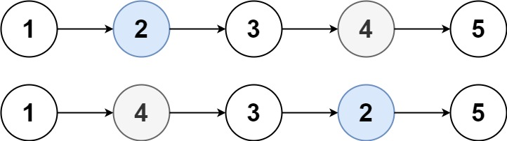

# [LeetCode][leetcode] task # 1721: [Swapping Nodes in a Linked List][task]

Description
-----------

> You are given the `head` of a linked list, and an integer `k`.
> 
> Return _the head of the linked list after **swapping** the values of the `k^th` node
> from the beginning and the `k^th` node from the end (the list is **1-indexed**).



Example
-------

```sh
Input: head = [1,2,3,4,5], k = 2
Output: [1,4,3,2,5]
```

Solution
--------

| Task | Solution                                    |
|:----:|:--------------------------------------------|
| 1721 | [Swapping Nodes in a Linked List][solution] |


[leetcode]: <http://leetcode.com/>
[task]: <https://leetcode.com/problems/swapping-nodes-in-a-linked-list/>
[solution]: <https://github.com/wellaxis/praxis-leetcode/blob/main/src/main/java/com/witalis/praxis/leetcode/task/h18/p1721/option/Practice.java>
