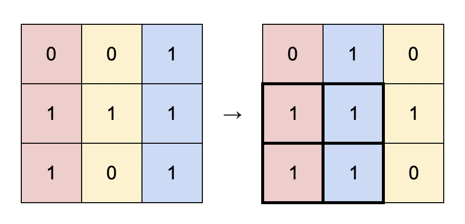

# [LeetCode][leetcode] task # 1727: [Largest Submatrix With Rearrangements][task]

Description
-----------

> You are given a binary matrix `matrix` of size `m x n`,
> and you are allowed to rearrange the **columns** of the `matrix` in any order.
> 
> Return _the area of the largest submatrix within `matrix`
> where **every** element of the submatrix is `1` after reordering the columns optimally_.

 Example
-------



```sh
Input: matrix = [[0,0,1],[1,1,1],[1,0,1]]
Output: 4
Explanation: You can rearrange the columns as shown above.
    The largest submatrix of 1s, in bold, has an area of 4.
```

Solution
--------

| Task | Solution                                          |
|:----:|:--------------------------------------------------|
| 1727 | [Largest Submatrix With Rearrangements][solution] |


[leetcode]: <http://leetcode.com/>
[task]: <https://leetcode.com/problems/shortest-path-in-binary-matrix/description/>
[solution]: <https://github.com/wellaxis/praxis-leetcode/blob/main/src/main/java/com/witalis/praxis/leetcode/task/h18/p1727/option/Practice.java>
