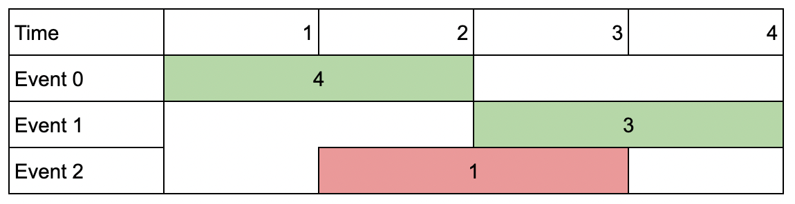

# [LeetCode][leetcode] task # 1751: [Maximum Number of Events That Can Be Attended II][task]

Description
-----------

> You are given an array of `events` where `events[i] = [startDayi, endDayi, valuei]`.
> The `i^th` event starts at `startDayi` and ends at `endDayi`,
> and if you attend this event, you will receive a value of `valuei`.
> You are also given an integer `k` which represents the maximum number of events you can attend.
> 
> You can only attend one event at a time. If you choose to attend an event, you must attend the **entire** event.
> Note that the end day is **inclusive**: that is, you cannot attend two events
> where one of them starts and the other ends on the same day.
> 
> Return _the maximum sum of values that you can receive by attending events_.

Example
-------



```sh
Input: events = [[1,2,4],[3,4,3],[2,3,1]], k = 2
Output: 7
Explanation: Choose the green events, 0 and 1 (0-indexed) for a total value of 4 + 3 = 7.
```

Solution
--------

| Task | Solution                                                     |
|:----:|:-------------------------------------------------------------|
| 1751 | [Maximum Number of Events That Can Be Attended II][solution] |


[leetcode]: <http://leetcode.com/>
[task]: <https://leetcode.com/problems/maximum-number-of-events-that-can-be-attended-ii/>
[solution]: <https://github.com/wellaxis/praxis-leetcode/blob/main/src/main/java/com/witalis/praxis/leetcode/task/h18/p1751/option/Practice.java>
