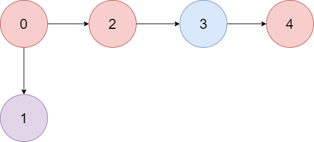

# [LeetCode][leetcode] task # 1857: [Largest Color Value in a Directed Graph][task]

Description
-----------

> There is a **directed graph** of `n` colored nodes and `m` edges. The nodes are numbered from `0` to `n - 1`.
> 
> You are given a string `colors` where `colors[i]` is a lowercase English letter
> representing the **color** of the `i^th` node in this graph (**0-indexed**).
> You are also given a 2D array `edges` where `edges[j] = [aj, bj]` indicates
> that there is a **directed edge** from node `aj` to node `bj`.
> 
> A valid **path** in the graph is a sequence of nodes `x1 -> x2 -> x3 -> ... -> xk` such that
> there is a directed edge from `xi` to `xi+1` for every `1 <= i < k`.
> The **color value** of the path is the number of nodes that are colored the **most frequently** occurring color along that path.
> 
> Return _the **largest color value** of any valid path in the given graph, or `-1` if the graph contains a cycle_.

 Example
-------



```sh
Input: colors = "abaca", edges = [[0,1],[0,2],[2,3],[3,4]]
Output: 3
Explanation: The path 0 -> 2 -> 3 -> 4 contains 3 nodes that are colored "a" (red in the above image).
```

Solution
--------

| Task | Solution                                            |
|:----:|:----------------------------------------------------|
| 1857 | [Largest Color Value in a Directed Graph][solution] |


[leetcode]: <http://leetcode.com/>
[task]: <https://leetcode.com/problems/largest-color-value-in-a-directed-graph/>
[solution]: <https://github.com/wellaxis/praxis-leetcode/blob/main/src/main/java/com/witalis/praxis/leetcode/task/h19/p1857/option/Practice.java>
