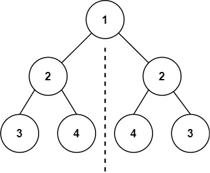

# [LeetCode][leetcode] task # 101: [Symmetric Tree][task]

Description
-----------

> Given the `root` of a binary tree,
> _check whether it is a mirror of itself_
> (i.e., symmetric around its center).

 Example
-------



```sh
Input: root = [1,2,2,3,4,4,3]
Output: true
```

Solution
--------

| Task | Solution                   |
|:----:|:---------------------------|
| 101  | [Symmetric Tree][solution] |


[leetcode]: <http://leetcode.com/>
[task]: <https://leetcode.com/problems/symmetric-tree/>
[solution]: <https://github.com/wellaxis/praxis-leetcode/blob/main/src/main/java/com/witalis/praxis/leetcode/task/h2/p101/option/Practice.java>
