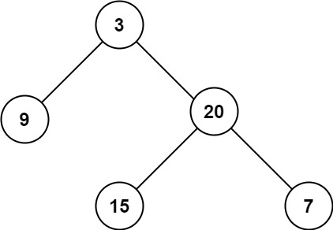

# [LeetCode][leetcode] task # 104: [Maximum Depth of Binary Tree][task]

Description
-----------

> Given the `root` of a binary tree, return _its maximum depth_.
> 
> A binary tree's **maximum depth** is the number of nodes
> along the longest path from the root node down to the farthest leaf node.

 Example
-------



```sh
Input: root = [3,9,20,null,null,15,7]
Output: 3
```

Solution
--------

| Task | Solution                                 |
|:----:|:-----------------------------------------|
| 104  | [Maximum Depth of Binary Tree][solution] |


[leetcode]: <http://leetcode.com/>
[task]: <https://leetcode.com/problems/maximum-depth-of-binary-tree/>
[solution]: <https://github.com/wellaxis/praxis-leetcode/blob/main/src/main/java/com/witalis/praxis/leetcode/task/h2/p104/option/Practice.java>
