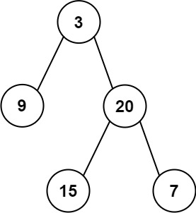

# [LeetCode][leetcode] task # 105: [Construct Binary Tree from Preorder and Inorder Traversal][task]

Description
-----------

> Given two integer arrays `preorder` and `inorder`
> where `preorder` is the preorder traversal of a binary tree
> and `inorder` is the inorder traversal of the same tree,
> construct and return _the binary tree_.

 Example
-------



```sh
Input: preorder = [3,9,20,15,7], inorder = [9,3,15,20,7]
Output: [3,9,20,null,null,15,7]
```

Solution
--------

| Task | Solution                                                              |
|:----:|:----------------------------------------------------------------------|
| 105  | [Construct Binary Tree from Preorder and Inorder Traversal][solution] |


[leetcode]: <http://leetcode.com/>
[task]: <https://leetcode.com/problems/construct-binary-tree-from-preorder-and-inorder-traversal/>
[solution]: <https://github.com/wellaxis/praxis-leetcode/blob/main/src/main/java/com/witalis/praxis/leetcode/task/h2/p105/option/Practice.java>
