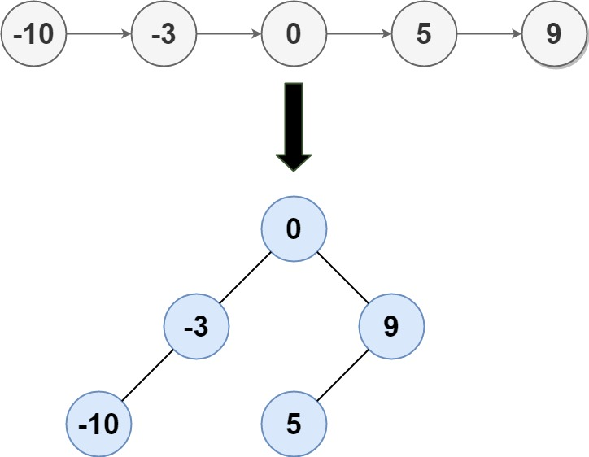

# [LeetCode][leetcode] task # 109: [Convert Sorted List to Binary Search Tree][task]

Description
-----------

> Given the `head` of a singly linked list where elements are
> **sorted in ascending order**, convert it to a height balanced BST.
> 
> For this problem, a height-balanced binary tree is defined as a binary tree
> in which the depth of the two subtrees of _every_ node never differ by more than 1.

 Example
-------



```sh
Input: head = [-10,-3,0,5,9]
Output: [0,-3,9,-10,null,5]
Explanation: One possible answer is [0,-3,9,-10,null,5],
             which represents the shown height balanced BST.
```

Solution
--------

| Task | Solution                                              |
|:----:|:------------------------------------------------------|
| 109  | [Convert Sorted List to Binary Search Tree][solution] |


[leetcode]: <http://leetcode.com/>
[task]: <https://leetcode.com/problems/convert-sorted-list-to-binary-search-tree/>
[solution]: <https://github.com/wellaxis/praxis-leetcode/blob/main/src/main/java/com/witalis/praxis/leetcode/task/h2/p109/option/Practice.java>
