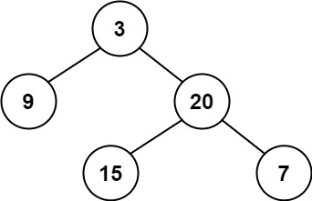

# [LeetCode][leetcode] task # 110: [Balanced Binary Tree][task]

Description
-----------

> Given a binary tree, determine if it is height-balanced.
> 
> For this problem, a height-balanced binary tree is defined as:
>> a binary tree in which the left and right subtrees
>> of every node differ in height by no more than 1.

 Example
-------



```sh
Input: root = [3,9,20,null,null,15,7]
Output: true
```

Solution
--------

| Task | Solution                         |
|:----:|:---------------------------------|
| 110  | [Balanced Binary Tree][solution] |


[leetcode]: <http://leetcode.com/>
[task]: <https://leetcode.com/problems/balanced-binary-tree/>
[solution]: <https://github.com/wellaxis/witalis-jkit/blob/main/module/tasks/src/main/java/com/witalis/jkit/tasks/core/task/leetcode/h2/p110/option/Practice.java>
