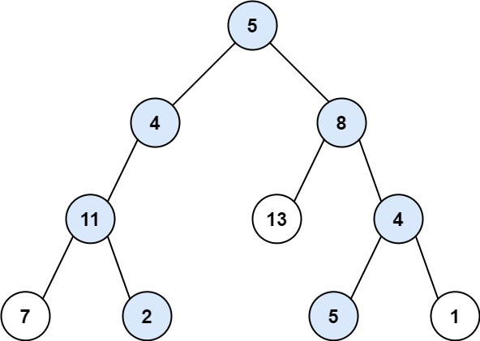

# [LeetCode][leetcode] task # 113: [Path Sum II][task]

Description
-----------

> Given the `root` of a binary tree and an integer `targetSum`,
> return _all **root-to-leaf** paths where the sum
> of the node values in the path equals `targetSum`_.
> _Each path should be returned as a list of the node **values**, not node references_.
> 
> A **root-to-leaf** path is a path starting from the root
> and ending at any leaf node. A **leaf** is a node with no children.

 Example
-------



```sh
Input: root = [5,4,8,11,null,13,4,7,2,null,null,5,1], targetSum = 22
Output: [[5,4,11,2],[5,8,4,5]]
Explanation:
    There are two paths whose sum equals targetSum:
    5 + 4 + 11 + 2 = 22
    5 + 8 + 4 + 5 = 22
```

Solution
--------

| Task | Solution                |
|:----:|:------------------------|
| 113  | [Path Sum II][solution] |


[leetcode]: <http://leetcode.com/>
[task]: <https://leetcode.com/problems/path-sum-ii/>
[solution]: <https://github.com/wellaxis/praxis-leetcode/blob/main/src/main/java/com/witalis/praxis/leetcode/task/h2/p113/option/Practice.java>
