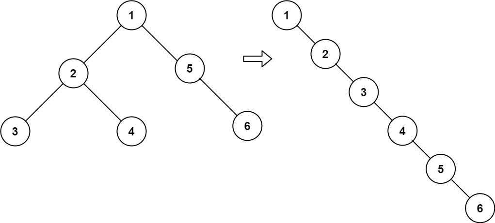

# [LeetCode][leetcode] task # 114: [Flatten Binary Tree to Linked List][task]

Description
-----------

> Given the `root` of a binary tree, flatten the tree into a "linked list":
> * The "linked list" should use the same `TreeNode` class where the `right` child pointer
>   points to the next node in the list and the `left` child pointer is always `null`.
> * The "linked list" should be in the same order as a **pre-order traversal** of the binary tree.

 Example
-------



```sh
Input: root = [1,2,5,3,4,null,6]
Output: [1,null,2,null,3,null,4,null,5,null,6]
```

Solution
--------

| Task | Solution                                       |
|:----:|:-----------------------------------------------|
| 114  | [Flatten Binary Tree to Linked List][solution] |


[leetcode]: <http://leetcode.com/>
[task]: <https://leetcode.com/problems/path-sum-ii/>
[solution]: <https://github.com/wellaxis/witalis-jkit/blob/main/module/tasks/src/main/java/com/witalis/jkit/tasks/core/task/leetcode/h2/p114/option/Practice.java>
