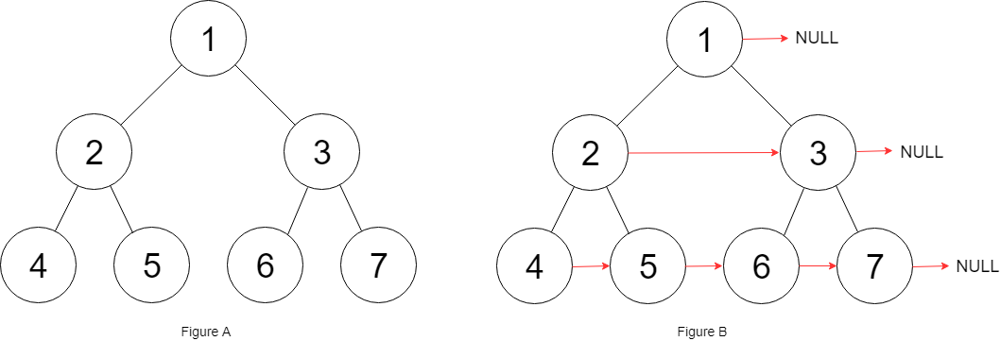

# [LeetCode][leetcode] task # 116: [Populating Next Right Pointers in Each Node][task]

Description
-----------

> You are given a **perfect binary tree** where all leaves are on the same level,
> and every parent has two children. The binary tree has the following definition:

```sh
struct Node {
    int val;
    Node *left;
    Node *right;
    Node *next;
}
```
> Populate each next pointer to point to its next right node.
> If there is no next right node, the next pointer should be set to `NULL`.
> 
> Initially, all next pointers are set to `NULL`.

 Example
-------



```sh
Input: root = [1,2,3,4,5,6,7]
Output: [1,#,2,3,#,4,5,6,7,#]
Explanation: Given the above perfect binary tree (Figure A),
    your function should populate each next pointer to point to its next right node, just like in Figure B.
    The serialized output is in level order as connected by the next pointers, with '#' signifying the end of each level.
```

Solution
--------

| Task | Solution                                                |
|:----:|:--------------------------------------------------------|
| 116  | [Populating Next Right Pointers in Each Node][solution] |


[leetcode]: <http://leetcode.com/>
[task]: <https://leetcode.com/problems/path-sum-ii/>
[solution]: <https://github.com/wellaxis/witalis-jkit/blob/main/module/tasks/src/main/java/com/witalis/jkit/tasks/core/task/leetcode/h2/p116/option/Practice.java>
