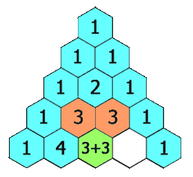

# [LeetCode][leetcode] task # 118: [Pascal's Triangle][task]

Description
-----------

> Given an integer `numRows`,
> return the first numRows of **Pascal's triangle**.
> 
> In **Pascal's triangle**, each number is the sum
> of the two numbers directly above it as shown:



Example
-------

```sh
Input: numRows = 5
Output: [[1],[1,1],[1,2,1],[1,3,3,1],[1,4,6,4,1]]
```

Solution
--------

| Task | Solution                      |
|:----:|:------------------------------|
| 118  | [Pascal's Triangle][solution] |


[leetcode]: <http://leetcode.com/>
[task]: <https://leetcode.com/problems/pascals-triangle/>
[solution]: <https://github.com/wellaxis/witalis-jkit/blob/main/module/tasks/src/main/java/com/witalis/jkit/tasks/core/task/leetcode/h2/p118/option/Practice.java>
