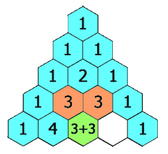

# [LeetCode][leetcode] task # 119: [Pascal's Triangle II][task]

Description
-----------

> Given an integer `rowIndex`,
> return the `rowIndex th` (**0-indexed**) row
> of the **Pascal's triangle**.
> 
> In **Pascal's triangle**, each number is the sum
> of the two numbers directly above it as shown:



Example
-------

```sh
Input: rowIndex = 3
Output: [1,3,3,1]
```

Solution
--------

| Task | Solution                         |
|:----:|:---------------------------------|
| 119  | [Pascal's Triangle II][solution] |


[leetcode]: <http://leetcode.com/>
[task]: <https://leetcode.com/problems/pascals-triangle-ii/>
[solution]: <https://github.com/wellaxis/praxis-leetcode/blob/main/src/main/java/com/witalis/praxis/leetcode/task/h2/p119/option/Practice.java>
