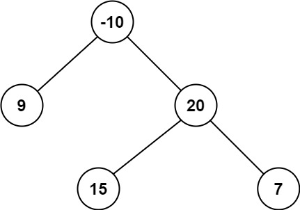

# [LeetCode][leetcode] task # 124: [Binary Tree Maximum Path Sum][task]

Description
-----------

> A **path** in a binary tree is a sequence of nodes where each pair of adjacent nodes in the sequence
> has an edge connecting them. A node can only appear in the sequence **at most once**.
> Note that the path does not need to pass through the root.
> 
> The **path sum** of a path is the sum of the node's values in the path.
> 
> Given the `root` of a binary tree, return _the maximum **path sum** of any **non-empty** path_.

 Example
-------



```sh
Input: root = [-10,9,20,null,null,15,7]
Output: 42
Explanation: The optimal path is 15 -> 20 -> 7 with a path sum of 15 + 20 + 7 = 42.
```

Solution
--------

| Task | Solution                                 |
|:----:|:-----------------------------------------|
| 124  | [Binary Tree Maximum Path Sum][solution] |


[leetcode]: <http://leetcode.com/>
[task]: <https://leetcode.com/problems/binary-tree-maximum-path-sum/>
[solution]: <https://github.com/wellaxis/praxis-leetcode/blob/main/src/main/java/com/witalis/praxis/leetcode/task/h2/p124/option/Practice.java>
