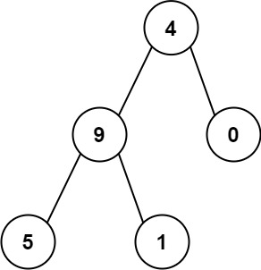

# [LeetCode][leetcode] task # 129: [Sum Root to Leaf Numbers][task]

Description
-----------

> You are given the `root` of a binary tree containing digits from `0` to `9` only.
> 
> Each root-to-leaf path in the tree represents a number.
> * For example, the root-to-leaf path `1 -> 2 -> 3` represents the number `123`.
> 
> Return _the total sum of all root-to-leaf numbers_.
> Test cases are generated so that the answer will fit in a **32-bit** integer.
> 
> A **leaf** node is a node with no children.

 Example
-------



```sh
Input: root = [4,9,0,5,1]
Output: 1026
Explanation:
    The root-to-leaf path 4->9->5 represents the number 495.
    The root-to-leaf path 4->9->1 represents the number 491.
    The root-to-leaf path 4->0 represents the number 40.
    Therefore, sum = 495 + 491 + 40 = 1026.
```

Solution
--------

| Task | Solution                             |
|:----:|:-------------------------------------|
| 129  | [Sum Root to Leaf Numbers][solution] |


[leetcode]: <http://leetcode.com/>
[task]: <https://leetcode.com/problems/sum-root-to-leaf-numbers/>
[solution]: <https://github.com/wellaxis/praxis-leetcode/blob/main/src/main/java/com/witalis/praxis/leetcode/task/h2/p129/option/Practice.java>
