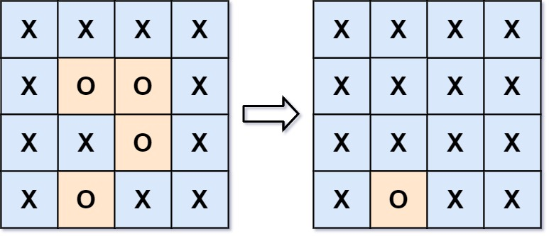

# [LeetCode][leetcode] task # 130: [Surrounded Regions][task]

Description
-----------

> Given an `m x n` matrix board containing `'X'` and `'O'`,
> _capture all regions that are 4-directionally surrounded by `'X'`_.
> 
> A region is **captured** by flipping all `'O'`s into `'X'`s in that surrounded region.

Example
-------



```sh
Input: board = [["X","X","X","X"],["X","O","O","X"],["X","X","O","X"],["X","O","X","X"]]
Output: [["X","X","X","X"],["X","X","X","X"],["X","X","X","X"],["X","O","X","X"]]
Explanation:
    Surrounded regions should not be on the border,
    which means that any 'O' on the border of the board are not flipped to 'X'.
    Any 'O' that is not on the border and it is not connected to an 'O' on the border will be flipped to 'X'.
    Two cells are connected if they are adjacent cells connected horizontally or vertically.
```

Solution
--------

| Task | Solution                       |
|:----:|:-------------------------------|
| 130  | [Surrounded Regions][solution] |


[leetcode]: <http://leetcode.com/>
[task]: <https://leetcode.com/problems/unique-paths/>
[solution]: <https://github.com/wellaxis/praxis-leetcode/blob/main/src/main/java/com/witalis/praxis/leetcode/task/h2/p130/option/Practice.java>
