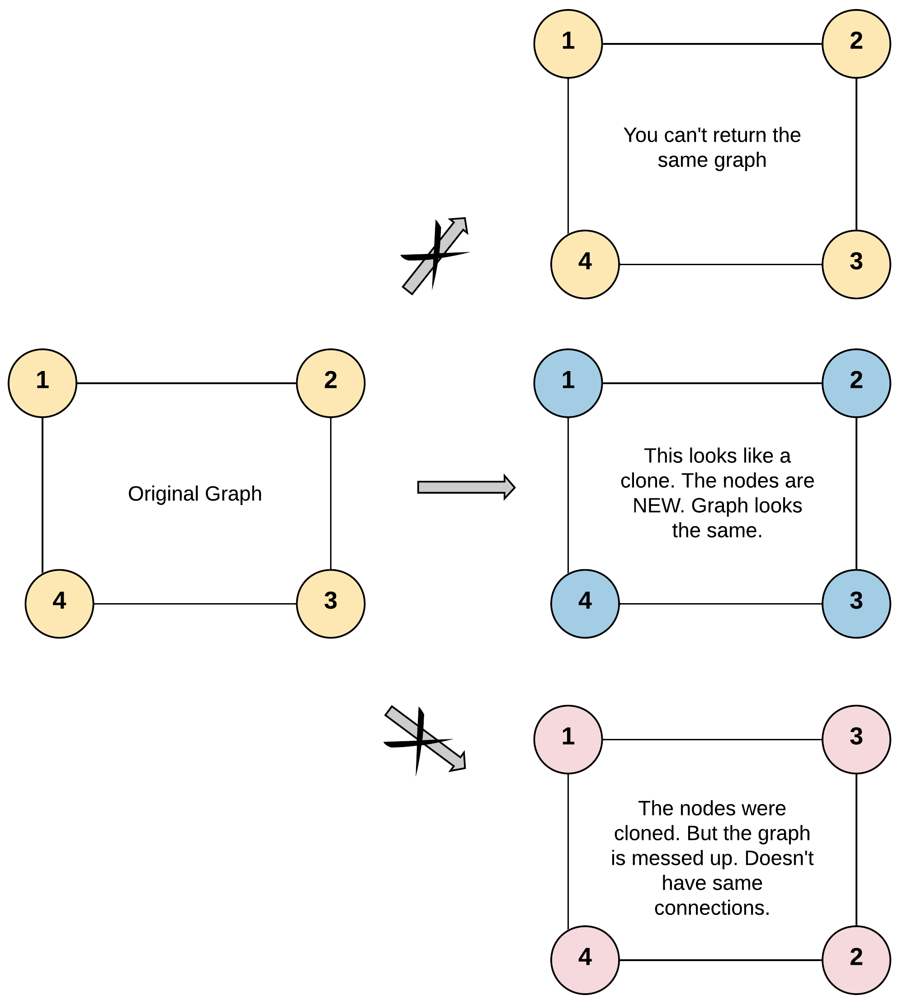

# [LeetCode][leetcode] task # 133: [Clone Graph][task]

Description
-----------

> Given a reference of a node in a **connected** undirected graph.
> Return a **deep copy** (clone) of the graph.
> Each node in the graph contains a value (`int`) and a list (`List[Node]`) of its neighbors.

```java
class Node {
    public int val;
    public List<Node> neighbors;
}
```

> Test case format:
> 
> For simplicity, each node's value is the same as the node's index (1-indexed).
> For example, the first node with `val == 1`, the second node with `val == 2`, and so on.
> The graph is represented in the test case using an adjacency list.
> 
> **An adjacency list** is a collection of unordered **lists** used to represent a finite graph.
> Each list describes the set of neighbors of a node in the graph.
> 
> The given node will always be the first node with `val = 1`.
> You must return the **copy of the given node** as a reference to the cloned graph.

 Example
-------



```sh
Input: adjList = [[2,4],[1,3],[2,4],[1,3]]
Output: [[2,4],[1,3],[2,4],[1,3]]
Explanation: There are 4 nodes in the graph.
    1st node (val = 1)'s neighbors are 2nd node (val = 2) and 4th node (val = 4).
    2nd node (val = 2)'s neighbors are 1st node (val = 1) and 3rd node (val = 3).
    3rd node (val = 3)'s neighbors are 2nd node (val = 2) and 4th node (val = 4).
    4th node (val = 4)'s neighbors are 1st node (val = 1) and 3rd node (val = 3).
```

Solution
--------

| Task | Solution                |
|:----:|:------------------------|
| 133  | [Clone Graph][solution] |


[leetcode]: <http://leetcode.com/>
[task]: <https://leetcode.com/problems/clone-graph/>
[solution]: <https://github.com/wellaxis/praxis-leetcode/blob/main/src/main/java/com/witalis/praxis/leetcode/task/h2/p133/option/Practice.java>
