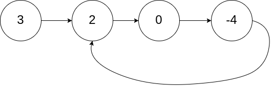

# [LeetCode][leetcode] task # 142: [Linked List Cycle II][task]

Description
-----------

> Given the `head` of a linked list, return _the node where the cycle begins_.
> _If there is no cycle, return `null`_.
> 
> There is a cycle in a linked list if there is some node in the list
> that can be reached again by continuously following the `next` pointer.
> Internally, `pos` is used to denote the index of the node
> that tail's `next` pointer is connected to (**0-indexed**).
> It is `-1` if there is no cycle. **Note that** `pos` **is not passed as a parameter**.
> 
> **Do not modify** the linked list.

Example
-------



```sh
Input: head = [3,2,0,-4], pos = 1
Output: tail connects to node index 1
Explanation: There is a cycle in the linked list, where tail connects to the second node.
```

Solution
--------

| Task | Solution                         |
|:----:|:---------------------------------|
| 142  | [Linked List Cycle II][solution] |


[leetcode]: <http://leetcode.com/>
[task]: <https://leetcode.com/problems/linked-list-cycle-ii/>
[solution]: <https://github.com/wellaxis/praxis-leetcode/blob/main/src/main/java/com/witalis/praxis/leetcode/task/h2/p142/option/Practice.java>
