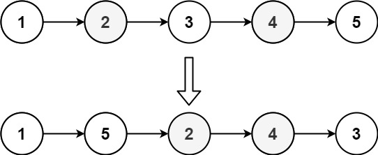

# [LeetCode][leetcode] task # 143: [Reorder List][task]

Description
-----------

> You are given the `head` of a singly linked-list. The list can be represented as:
```md
L0 → L1 → … → Ln - 1 → Ln
```
> Reorder the list to be on the following form:
```md
L0 → Ln → L1 → Ln - 1 → L2 → Ln - 2 → …
```
> You may not modify the values in the list's nodes. Only nodes themselves may be changed.

Example
-------



```sh
Input: head = [1,2,3,4,5]
Output: [1,5,2,4,3]
```

Solution
--------

| Task | Solution                 |
|:----:|:-------------------------|
| 143  | [Reorder List][solution] |


[leetcode]: <http://leetcode.com/>
[task]: <https://leetcode.com/problems/reorder-list/>
[solution]: <https://github.com/wellaxis/witalis-jkit/blob/main/module/tasks/src/main/java/com/witalis/jkit/tasks/core/task/leetcode/h2/p143/option/Practice.java>
