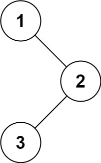

# [LeetCode][leetcode] task # 144: [Binary Tree Preorder Traversal][task]

Description
-----------

> Given the `root` of a binary tree,
> return _the preorder traversal of its nodes' values_.

Example
-------



```sh
Input: root = [1,null,2,3]
Output: [1,2,3]
```

Solution
--------

| Task | Solution                                   |
|:----:|:-------------------------------------------|
| 144  | [Binary Tree Preorder Traversal][solution] |


[leetcode]: <http://leetcode.com/>
[task]: <https://leetcode.com/problems/binary-tree-preorder-traversal/>
[solution]: <https://github.com/wellaxis/witalis-jkit/blob/main/module/tasks/src/main/java/com/witalis/jkit/tasks/core/task/leetcode/h2/p144/option/Practice.java>
