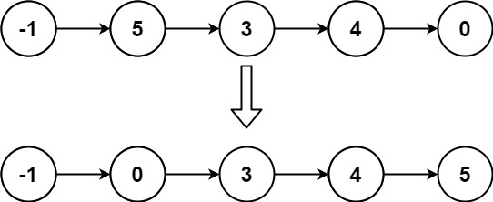

# [LeetCode][leetcode] task # 147: [Insertion Sort List][task]

Description
-----------

> Given the `head` of a singly linked list, sort the list using **insertion sort**,
> and _return the sorted list's head_.
> 
> The steps of the **insertion sort** algorithm:
> 1. Insertion sort iterates, consuming one input element each repetition and growing a sorted output list.
> 2. At each iteration, insertion sort removes one element from the input data,
> finds the location it belongs within the sorted list and inserts it there.
> 3. It repeats until no input elements remain.
>
> The following is a graphical example of the insertion sort algorithm.
> The partially sorted list (black) initially contains only the first element in the list.
> One element (red) is removed from the input data and inserted in-place into the sorted list with each iteration.

Example
-------



```sh
Input: head = [-1,5,3,4,0]
Output: [-1,0,3,4,5]
```

Solution
--------

| Task | Solution                        |
|:----:|:--------------------------------|
| 147  | [Insertion Sort List][solution] |


[leetcode]: <http://leetcode.com/>
[task]: <https://leetcode.com/problems/insertion-sort-list/>
[solution]: <https://github.com/wellaxis/witalis-jkit/blob/main/module/tasks/src/main/java/com/witalis/jkit/tasks/core/task/leetcode/h2/p147/option/Practice.java>
