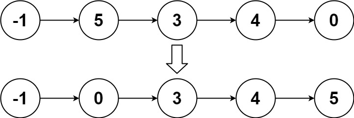

# [LeetCode][leetcode] task # 148: [Sort List][task]

Description
-----------

> Given the `head` of a linked list, return _the list after sorting it in **ascending order**_.

Example
-------



```sh
Input: head = [-1,5,3,4,0]
Output: [-1,0,3,4,5]
```

Solution
--------

| Task | Solution              |
|:----:|:----------------------|
| 148  | [Sort List][solution] |


[leetcode]: <http://leetcode.com/>
[task]: <https://leetcode.com/problems/sort-list/>
[solution]: <https://github.com/wellaxis/praxis-leetcode/blob/main/src/main/java/com/witalis/praxis/leetcode/task/h2/p148/option/Practice.java>
